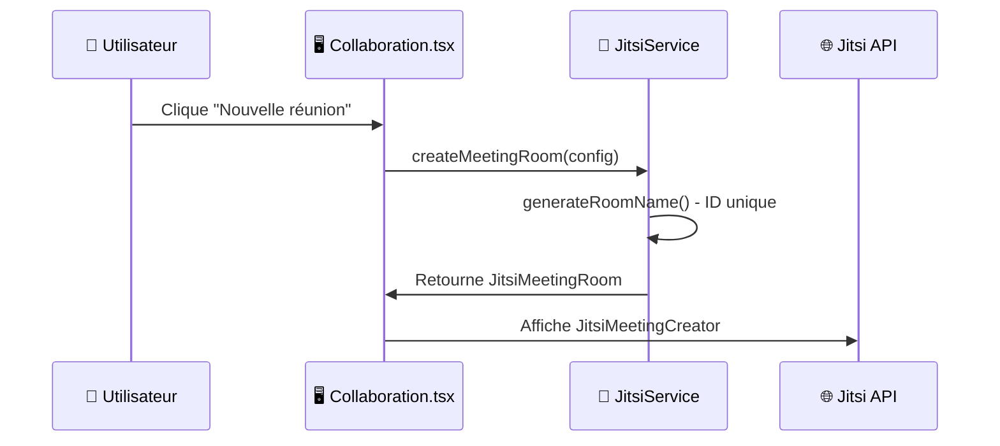
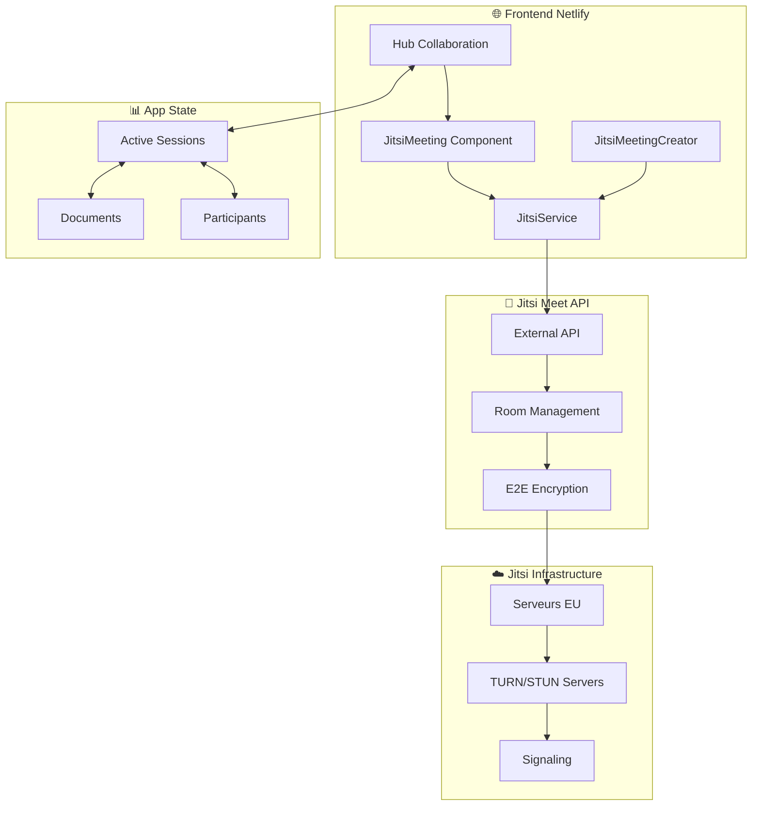

# 🎯 Hub de Collaboration Jitsi Meet - Analyse Technique Complète

## 📋 **Vue d'Ensemble de l'Architecture**

### 🏗️ **Structure de l'Intégration**
```
src/components/collaboration/
├── Collaboration.tsx        # Hub principal avec gestion sessions
├── JitsiMeeting.tsx        # Composant réunion Jitsi intégré
├── JitsiMeetingCreator.tsx # Créateur de salles sécurisées
└── ChatWindow.tsx          # Chat temps réel synchronisé

src/services/
└── jitsiService.ts         # Service principal Jitsi Meet
```

## 🔐 **Configuration et Sécurité**

### **1. Instance Jitsi Utilisée**
```typescript
// Utilise l'API publique officielle Jitsi Meet
private baseUrl = 'https://meet.jit.si';
private domain = 'meet.jit.si';

// Script API externe officiel
script.src = 'https://meet.jit.si/external_api.js';
```

**✅ Avantages :**
- **Serveurs européens** : Hébergement EU conforme RGPD
- **Haute disponibilité** : Infrastructure officiellement maintenue
- **Zero-config** : Pas d'hébergement ou maintenance serveur

**⚠️ Limitations :**
- Dépendance externe (mais stable)
- Pas de contrôle total sur les serveurs

### **2. Sécurité Avancée**

#### **A. Chiffrement de Bout en Bout (E2EE)**
```typescript
// Configuration automatique E2EE
enableE2EE: config.enableE2EE ?? true,
e2eeLabels: {
  tooltip: 'Chiffrement de bout en bout activé',
  warning: 'Attention: Le chiffrement peut affecter les performances'
},

// Activation automatique si configuré
if (config.enableE2EE) {
  this.api.executeCommand('toggleE2EE');
}
```

#### **B. Authentification et Permissions**
```typescript
// Génération de salles uniques et sécurisées
generateRoomName(prefix: string = 'centrinote'): string {
  const timestamp = Date.now();
  const random = Math.random().toString(36).substring(2, 15);
  return `${prefix}-${timestamp}-${random}`;
}

// Protection par mot de passe optionnelle
if (config.password) {
  this.api.executeCommand('password', config.password);
}
```

#### **C. Configuration Sécurisée**
```typescript
configOverwrite: {
  // Désactivation des requêtes tierces
  disableThirdPartyRequests: true,
  
  // Protection contre les liens profonds
  disableDeepLinking: true,
  
  // Configuration du lobby sécurisé
  enableLobby: config.enableLobby,
  
  // Contrôle d'accès granulaire
  enableLobbyChat: config.enableLobby
}
```

## 🚀 **Fonctionnement Technique**

### **3. Cycle de Vie d'une Session**

#### **Phase 1: Création de Salle**


#### **Phase 2: Initialisation API**
```typescript
// Chargement dynamique de l'API Jitsi
const loadJitsiScript = () => {
  const script = document.createElement('script');
  script.src = 'https://meet.jit.si/external_api.js';
  script.async = true;
  script.onload = () => setIsJitsiLoaded(true);
};

// Initialisation sécurisée
const api = await jitsiService.initializeJitsiAPI('jitsi-container', {
  roomName: room.config.roomName,
  displayName: user.name,
  email: user.email,
  enableE2EE: true,
  enableLobby: false,
  password: room.password
});
```

#### **Phase 3: Gestion Temps Réel**
```typescript
// Événements synchronisés en temps réel
api.addEventListener('participantJoined', () => {
  setMeetingStats(prev => ({ ...prev, participants: prev.participants + 1 }));
});

api.addEventListener('participantLeft', () => {
  setMeetingStats(prev => ({ ...prev, participants: Math.max(0, prev.participants - 1) }));
});

api.addEventListener('recordingStatusChanged', (event) => {
  setMeetingStats(prev => ({ ...prev, isRecording: event.on }));
});
```

### **4. Synchronisation avec Documents**

#### **A. Sessions Documentaires**
```typescript
interface ActiveSession {
  id: string;
  title: string;
  type: 'document' | 'study' | 'discussion' | 'video';
  documentIds?: string[];        // 🔗 Lien avec documents
  meetingRoom?: JitsiMeetingRoom; // 🎥 Salle Jitsi associée
  participants: Participant[];
  isActive: boolean;
}
```

#### **B. Hub de Collaboration**
```typescript
// Le hub central synchronise :
const [activeSessions, setActiveSessions] = useState<ActiveSession[]>();
const [currentJitsiMeeting, setCurrentJitsiMeeting] = useState<JitsiMeetingRoom | null>();
const [jitsiMeetings, setJitsiMeetings] = useState<JitsiMeetingRoom[]>();

// Synchronisation bidirectionnelle
const handleJoinSession = (session: ActiveSession) => {
  if (session.meetingRoom) {
    setCurrentJitsiMeeting(session.meetingRoom); // 🎥 Lance Jitsi
  }
  if (session.documentIds) {
    // 📄 Ouvre documents associés
    openDocuments(session.documentIds);
  }
};
```

## 🌟 **Fonctionnalités Avancées**

### **5. Interface Professionnelle**

#### **A. Stats Temps Réel**
```tsx
// Affichage dynamique des métriques
<div className="flex items-center space-x-4 text-sm">
  <div className="flex items-center space-x-1">
    <Users className="w-4 h-4" />
    <span>{meetingStats.participants} participants</span>
  </div>
  
  {room.config.enableE2EE && (
    <div className="flex items-center space-x-1 text-green-500">
      <Shield className="w-4 h-4" />
      <span>E2EE</span>
    </div>
  )}
  
  {meetingStats.isRecording && (
    <div className="flex items-center space-x-1 text-red-500">
      <div className="w-2 h-2 bg-red-500 rounded-full animate-pulse"></div>
      <span>Enregistrement</span>
    </div>
  )}
</div>
```

#### **B. Partage Sécurisé**
```typescript
// Génération liens de partage avec paramètres
generateShareableLink(room: JitsiMeetingRoom): string {
  let url = room.url;
  const params = new URLSearchParams();
  
  if (room.config.enableE2EE) {
    params.append('config.enableE2EE', 'true');
  }
  
  if (room.config.subject) {
    params.append('config.subject', encodeURIComponent(room.config.subject));
  }
  
  return url + (params.toString() ? `#${params.toString()}` : '');
}
```

### **6. Compatibilité et Tests**

#### **A. Vérification Navigateur**
```typescript
checkBrowserCompatibility(): { compatible: boolean; issues: string[] } {
  const issues: string[] = [];
  
  // WebRTC requis
  if (!navigator.mediaDevices || !navigator.mediaDevices.getUserMedia) {
    issues.push('WebRTC non supporté');
  }
  
  // HTTPS obligatoire (sauf localhost)
  if (location.protocol !== 'https:' && location.hostname !== 'localhost') {
    issues.push('HTTPS requis pour les permissions caméra/microphone');
  }
  
  return { compatible: issues.length === 0, issues };
}
```

#### **B. Test Permissions Média**
```typescript
async testMediaPermissions(): Promise<{ camera: boolean; microphone: boolean; error?: string }> {
  try {
    const stream = await navigator.mediaDevices.getUserMedia({ 
      video: true, 
      audio: true 
    });
    
    const result = {
      camera: stream.getVideoTracks().length > 0,
      microphone: stream.getAudioTracks().length > 0
    };
    
    // Nettoyage du stream de test
    stream.getTracks().forEach(track => track.stop());
    
    return result;
  } catch (error) {
    return { camera: false, microphone: false, error: error.message };
  }
}
```

## 🚀 **Production sur Netlify**

### **7. Compatibilité et Limitations**

#### **✅ Fonctionnel en Production**
- ✅ **HTTPS natif** sur Netlify (requis pour WebRTC)
- ✅ **API Jitsi externe** : Pas de problème CORS
- ✅ **Zero-config** : Aucune configuration serveur nécessaire
- ✅ **Responsive** : Fonctionne mobile/desktop

#### **⚠️ Points d'Attention**
- **Dépendance réseau** : Requires connexion stable
- **Permissions navigateur** : Utilisateur doit autoriser caméra/micro
- **Bloqueurs pub** : Peuvent interférer avec Jitsi
- **Réseaux d'entreprise** : Parfois bloqués par pare-feu

#### **🔧 Configuration Netlify**
```toml
# Dans netlify.toml
[[headers]]
  for = "/*"
  [headers.values]
    # CSP configuré pour Jitsi Meet
    Content-Security-Policy = '''
      connect-src 'self' https://meet.jit.si https://8x8.vc https://*.jitsi.net;
      frame-src 'self' https://meet.jit.si https://8x8.vc;
      media-src 'self' https://meet.jit.si https://8x8.vc;
    '''
    
    # Permissions pour WebRTC
    Permissions-Policy = "camera=(), microphone=(), display-capture=()"
```

## 🎯 **Flux Technique Complet**

### **8. Schéma d'Architecture**



## 📋 **Résumé des Réponses**

### **🔍 Questions Répondues :**

1. **API publique vs auto-hébergée ?**
   ➜ **API publique officielle** (`meet.jit.si`) avec avantages EU et RGPD

2. **Synchronisation sessions/documents ?**
   ➜ **Hub central** avec `ActiveSession` qui lie salles Jitsi et documentIds

3. **Fonctionnel sur Netlify ?**
   ➜ **✅ Complètement fonctionnel** avec HTTPS et CSP configurés

4. **Gestion sécurité ?**
   ➜ **E2EE natif**, salles uniques, mots de passe, lobby, permissions granulaires

### **⚡ Avantages Clés :**
- 🔐 **Sécurité maximale** (E2EE, HTTPS, permissions)
- 🌍 **Serveurs européens** (RGPD compliant)
- 🚀 **Zero-maintenance** (infrastructure gérée)
- 📱 **Cross-platform** (tous navigateurs)
- 🎯 **Intégration native** avec vos documents

**L'intégration Jitsi Meet est production-ready et sécurisée ! 🎉**