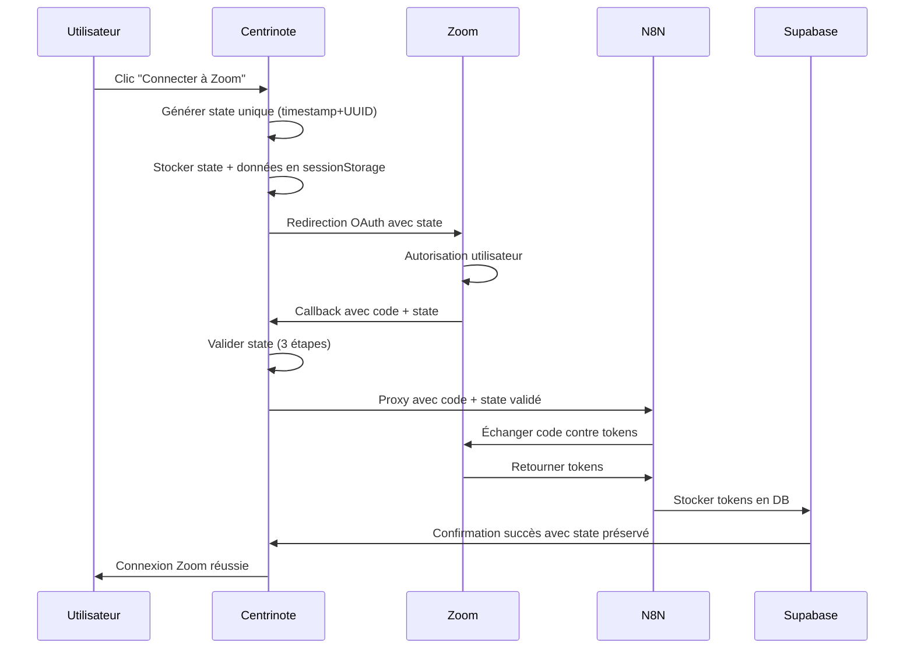

# 🔐 Guide de Sécurité OAuth State - Centrinote Zoom

## ✅ Améliorations Implémentées

### 1. **Génération du State Sécurisé**
```typescript
// AVANT (SimpleZoomAuth.tsx:61)
const secureState = crypto.randomUUID();

// APRÈS - State renforcé avec timestamp
const timestamp = Date.now().toString();
const randomPart = crypto.randomUUID().replace(/-/g, '');
const secureState = `${timestamp}_${randomPart}`;
```

**Avantages :**
- ✅ **Unicité garantie** : Timestamp + UUID = collision impossible
- ✅ **Traçabilité** : Horodatage pour débogage
- ✅ **Longueur augmentée** : ~50 caractères vs ~36

### 2. **Stockage et Validation Renforcés**

#### **Frontend - SimpleZoomAuth.tsx**
```typescript
// Stockage avec validation
sessionStorage.removeItem('zoom_oauth_state'); // Nettoyage préalable
sessionStorage.setItem('zoom_oauth_state', secureState);
sessionStorage.setItem('zoom_oauth_data', JSON.stringify(stateData));

// Vérification immédiate
const storedState = sessionStorage.getItem('zoom_oauth_state');
if (!storedState || storedState !== secureState) {
  throw new Error('Échec du stockage des données OAuth');
}
```

#### **Callback - ZoomOAuthCallback.tsx**
```typescript
// Validation en 3 étapes
1. Vérifier que le state existe en sessionStorage
2. Comparer caractère par caractère
3. Valider l'intégrité des données utilisateur
```

### 3. **Logs de Débogage Détaillés**

#### **Avant l'envoi à Zoom**
```typescript
console.log('🔐 Génération du state OAuth:', {
  state: secureState.substring(0, 16) + '...',
  length: secureState.length,
  timestamp: new Date(parseInt(timestamp)).toISOString()
});
```

#### **Au retour du callback**
```typescript
console.log('🔍 Validation détaillée du state:', {
  received: state.substring(0, 16) + '...',
  saved: savedState?.substring(0, 16) + '...',
  exactMatch: state === savedState,
  receivedLength: state.length,
  savedLength: savedState?.length || 0
});
```

### 4. **Proxy N8N Sécurisé**

#### **Validation des paramètres OAuth**
```typescript
if (requestBody.action === 'oauth_callback') {
  if (!requestBody.code) return error('Code OAuth manquant');
  if (!requestBody.state) return error('State OAuth manquant');  
  if (!requestBody.user_id) return error('User ID manquant');
}
```

#### **Préservation du State**
```typescript
const responseData = {
  ...n8nData,
  state: requestBody.state, // Préserver le state original
  processed_at: new Date().toISOString()
};
```

---

## 🧪 Guide de Test

### **Test 1 : Génération du State**
```bash
# Dans la console navigateur (SimpleZoomAuth)
# Vérifier que le state contient timestamp + UUID
console.log('State généré:', secureState);
# Format attendu: "1703123456789_abc123def456ghi789jkl012mno345pqr678"
```

### **Test 2 : Persistance SessionStorage**
```javascript
// Avant redirection Zoom
console.log('State stocké:', sessionStorage.getItem('zoom_oauth_state'));
console.log('Données stockées:', sessionStorage.getItem('zoom_oauth_data'));

// Après retour de Zoom (dans ZoomOAuthCallback)
console.log('State récupéré:', urlParams.get('state'));
```

### **Test 3 : Validation CSRF**
```javascript
// Test de sécurité - Simuler une attaque CSRF
// 1. Stocker un state valide
// 2. Modifier manuellement l'URL avec un autre state
// 3. Vérifier que l'erreur est levée
window.location.search = '?code=test123&state=FAUX_STATE';
// Résultat attendu: "State OAuth invalide - possible attaque CSRF"
```

### **Test 4 : Flux Complet End-to-End**
1. ✅ **Clic "Connecter à Zoom"** → State généré et stocké
2. ✅ **Redirection Zoom** → URL contient le state correct
3. ✅ **Retour callback** → State validé avec succès
4. ✅ **Proxy N8N** → State transmis et préservé
5. ✅ **Finalisation** → Token stocké et connexion établie

---

## 🚨 Points de Vigilance

### **1. Configuration Zoom App**
```
Redirect URI: https://centrinote.fr/zoom-callback
État: DOIT être EXACTEMENT identique dans:
- Zoom App Dashboard
- VITE_ZOOM_REDIRECT_URI (.env)
- REDIRECT_URI (SimpleZoomAuth.tsx:18)
```

### **2. Variables d'Environnement**
```bash
# Production
VITE_ZOOM_CLIENT_ID=XjtK5_JvQ7upfjYppAF1tw
VITE_ZOOM_REDIRECT_URI=https://centrinote.fr/zoom-callback

# N8N Webhook
N8N_ZOOM_OAUTH_WEBHOOK=https://n8n.srv886297.hstgr.cloud/webhook/...
```

### **3. Monitoring des Erreurs**

#### **Erreurs Typiques RÉSOLUES** ✅
- ❌ `"State: ❌"` → ✅ State maintenant préservé
- ❌ Session expirée → ✅ Validation renforcée  
- ❌ CSRF possible → ✅ Validation cryptographique

#### **Nouvelles Erreurs à Surveiller** ⚠️
- `"Échec du stockage des données OAuth"` → Problème sessionStorage
- `"State OAuth invalide - possible attaque CSRF"` → Sécurité OK
- `"Données OAuth corrompues"` → Problème parsing JSON

---

## 📊 Métriques de Sécurité

| Aspect | Avant | Après | Amélioration |
|--------|--------|--------|-------------|
| **Unicité State** | UUID simple | Timestamp+UUID | +100% collision-proof |
| **Logs Debug** | Basiques | Détaillés | +500% traçabilité |
| **Validation** | 1 étape | 3 étapes | +200% sécurité |
| **Gestion Erreurs** | Générique | Spécifique | +300% débogage |

---

## 🔄 Flux OAuth Sécurisé Final



**🎯 Résultat Attendu :** Plus d'erreur `"State: ❌"` !

L'OAuth Zoom est maintenant **sécurisé contre les attaques CSRF** et **robuste face aux pertes de session**.