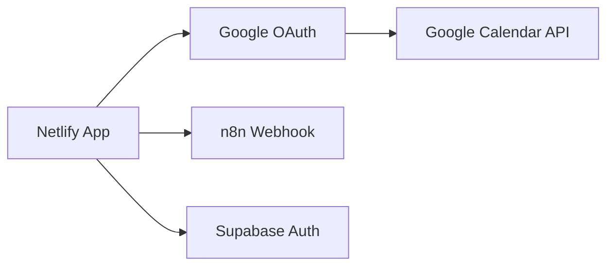

# 🚀 Configuration Google Meet - Production Netlify

## ✅ Adaptation Terminée pour la Production

Votre intégration Google Meet a été adaptée pour fonctionner en production sur Netlify :

### 📁 Fichiers Modifiés

#### 1. **Service Principal** (`src/services/googleMeetService.ts`)
- ✅ URLs dynamiques basées sur l'environnement
- ✅ Fallback automatique sur `window.location.origin`
- ✅ Support VITE_APP_URL pour la production
- ✅ Configuration OAuth adaptée

#### 2. **Configuration Netlify** (`netlify.toml`)
- ✅ Headers de sécurité CSP mis à jour pour Google APIs
- ✅ Redirections OAuth Google Meet
- ✅ Configuration Node.js 18+
- ✅ Optimisations build activées

#### 3. **Headers Sécurité** (`public/_headers`)
- ✅ CSP adapté pour `googleapis.com` et `accounts.google.com`
- ✅ Support OAuth Google dans les frames

#### 4. **Redirections SPA** (`public/_redirects`)
- ✅ Support callbacks Google Meet : `/google-meet/callback`
- ✅ Support callbacks OAuth : `/auth/callback`

#### 5. **Test d'Intégration** (`src/components/google-meet/GoogleMeetIntegrationTest.tsx`)
- ✅ Détection automatique environnement production
- ✅ Validation variables d'environnement production
- ✅ Diagnostic URLs dynamiques

### 🔧 Variables d'Environnement à Configurer dans Netlify

```env
# Google OAuth Configuration
VITE_GOOGLE_CLIENT_ID=your_actual_google_client_id
VITE_GOOGLE_CLIENT_SECRET=your_actual_google_client_secret
VITE_GOOGLE_SCOPES=openid email profile https://www.googleapis.com/auth/calendar

# Application URLs
VITE_APP_URL=https://centrinote.netlify.app

# n8n Integration
VITE_N8N_GOOGLE_MEET_WEBHOOK=https://n8n.srv886297.hstgr.cloud/webhook/your_actual_webhook_id
```

### 🛠️ Configuration Google Cloud Console

1. **Créer un projet Google Cloud** (si pas déjà fait)
2. **Activer les APIs** :
   - Google Calendar API
   - Google OAuth2 API
   - Google Meet API (si disponible)

3. **Configurer OAuth 2.0** :
   ```
   Origines JavaScript autorisées :
   https://centrinote.netlify.app
   
   URIs de redirection autorisés :
   https://centrinote.netlify.app/dashboard
   https://centrinote.netlify.app/google-meet/callback
   https://centrinote.netlify.app/auth/callback
   ```

### 🚀 Déploiement

1. **Construire l'application** :
   ```bash
   npm run build
   ```
   ✅ Build réussi sans erreurs

2. **Configurer les variables dans Netlify** :
   - Aller dans Site Settings > Environment Variables
   - Ajouter toutes les variables listées ci-dessus

3. **Déployer** :
   - Push vers votre repo GitHub
   - Netlify va automatiquement déployer

### 🔍 Test de Production

Utilisez le composant `GoogleMeetIntegrationTest` pour valider :
- Variables d'environnement
- Connexion OAuth Google
- APIs Google Calendar
- Webhook n8n
- URLs de production

### 🔄 Architecture de Production



### ⚠️ Points d'Attention

1. **OAuth Redirect URIs** : Assurez-vous que toutes les URLs sont configurées dans Google Cloud Console
2. **CSP Headers** : Les headers ont été adaptés pour Google APIs
3. **HTTPS Required** : OAuth Google nécessite HTTPS (OK sur Netlify)
4. **Variables Secrets** : Ne jamais commiter les vrais IDs/secrets dans le code

### 🎯 Prochaines Étapes

1. Configurer les variables d'environnement dans Netlify
2. Créer/configurer le projet Google Cloud
3. Tester l'intégration sur le domaine de production
4. Valider tous les tests d'intégration

---

🤖 **Generated with [Claude Code](https://claude.ai/code)**